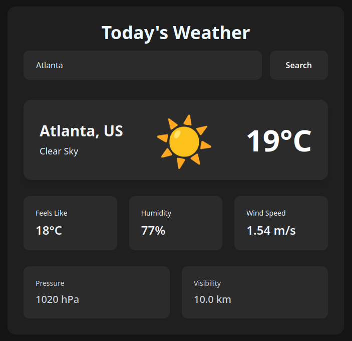

# React.js Weather App - Dark Theme 🌙

A sleek and responsive weather application that allows users to search for weather conditions in cities worldwide.



## ✨ Features

- **Dark UI Design**: Dark themed weather application.
- **City Search**: Find weather by city name (e.g., "Atlanta, GA" or "Tokyo, JP").
- **Real-Time API Fetching**: Data updates dynamically using OpenWeatherMap API.
- **Dynamic Weather Display**: Shows temperature (°C), conditions, and city name.
- **Responsive Design**: Works seamlessly on modern browsers.

## 🛠️ Tech Stack

- **Frontend**: React.js (Vite)
- **Styling**: Tailwind CSS
- **HTTP Client**: Axios
- **Weather API**: OpenWeatherMap

## 🚀 Getting Started

### Prerequisites

- Modern web browser
- [OpenWeatherMap API Key](https://openweathermap.org/api) (free tier)

## Customization

- You can modify the `API_KEY` in the JavaScript file to use your own OpenWeatherMap API key.
- Customize the colors and UI by modifying the Tailwind CSS classes.

## Folder Structure

```bash
📁 reactjs-weather-app
├── 📁 src
│   ├── 📁 components
│   │   ├── 📄 WeatherApp.jsx
│   │   ├── 📄 WeatherDetails.jsx
│   ├── 📄 App.css
│   ├── 📄 index.css
│   ├── 📄 main.jsx
└── 📄 vite.config.js
└── 📄 index.html
└── 📄 README.md
```

## ✨ Contribution

If you'd like to contribute to this project, feel free to submit issues or pull requests. Contributions are always welcome to improve this repository further!
